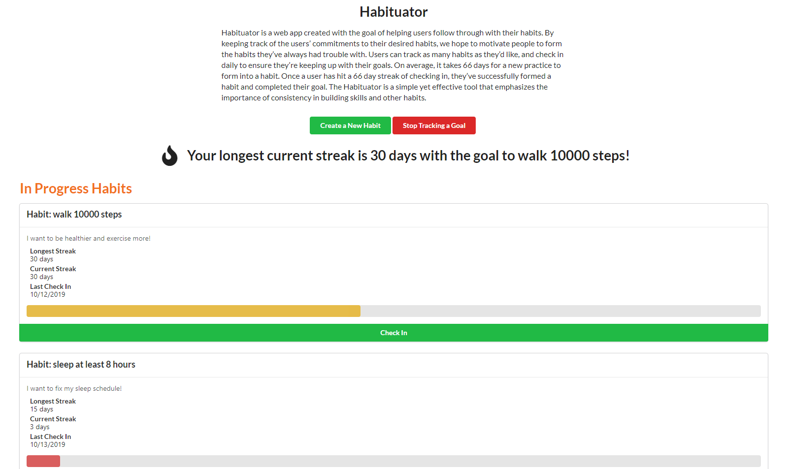

# Habituator

Created by Ivan Tan, Generous Yeh, Jonathan Cho, and Nathan Chung at DubHacks 2019.



Habituator is a web app created with the goal of 
helping users follow through with their habits. By 
keeping track of the users’ commitments to their 
desired habits, we hope to motivate people to form the 
habits they’ve always had trouble with. Users can track 
as many habits as they’d like, and check in daily to 
ensure they’re keeping up with their goals. On average, 
it takes 66 days for a new practice to form into a habit. 
Once a user has hit a 66 day streak of checking in, 
they’ve successfully formed a habit and completed their 
goal. The Habituator is a simple yet effective tool 
that emphasizes the importance of consistency in 
building skills and other habits.

## Getting Started
```bash
# clone repo
git clone https://github.com/ivanxtan/DubHacks-2019.git
cd DubHacks-2019

# install dependencies
npm install

# start the local server for development
npm run start
```